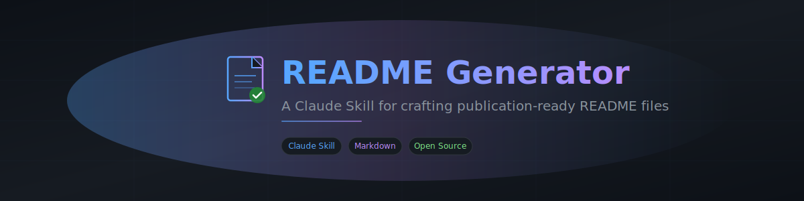

<div align="center">



# README Generator

> Turn any codebase into a stunning, GitHub-optimized README — in one command.


</div>


Point this skill at a project directory or just describe your project in plain English and it produces a complete, polished `README.md` with badges, banners, structured sections, social links, and everything a top-tier open-source repo needs. It scans your code, configs, and docs to extract accurate details, then asks smart questions to fill the gaps. No more blank-page syndrome.

## Why This Exists

Most READMEs are either barren single-liners or bloated walls of text nobody reads. This skill sits in the sweet spot: it understands your project deeply (by actually reading your code), structures the information for maximum impact, and writes with the polish of a seasoned open-source maintainer — not a template engine.

## Key Features

- 📂 **Deep codebase scanning** — Reads your `package.json`, `pyproject.toml`, `Dockerfile`, entry points, API routes, CLI parsers, and more to understand what your project actually does
- 🧠 **Smart gap-filling** — Asks targeted questions only for what it can't infer, and gracefully uses defaults when you say "you choose"
- 🏷️ **Auto-generated badges** — shields.io badges for license, version, language, stars, build status — configured from your actual repo metadata
- 📐 **24-section blueprint** — From banner image to star history, it knows exactly which sections apply to your project type and skips the rest
- 🔀 **Works three ways** — Give it a directory, describe your project in text, or both. It merges intelligently with user input always taking priority
- 🎨 **Visual-first design** — Centered logos, badge rows, collapsible sections, proper `<div align="center">` formatting that renders perfectly on GitHub
- 🤖 **ML/AI aware** — Knows when to add Model Architecture, Dataset, and Inference API sections for machine learning projects
- ✅ **Quality gates built in** — Passes the 3-second test (instant comprehension) and the clone-and-run test (installation instructions actually work)

## How It Works

```
You say: "Make me a README"
     ↓
📂 Skill scans your project directory
     ↓
❓ Asks smart questions (socials? banner? license?)
     ↓
📝 Writes a complete, publication-ready README.md
     ↓
✅ Delivers with shields.io badges, proper GFM, and zero broken links
```

The skill follows a 4-phase process:

1. **Gather Intelligence** — Scans config files, manifests, entry points, directory structure, images, licenses, and existing docs
2. **Smart Gap-Filling** — Identifies missing info and asks the user only what it can't infer. Checks memory for social links and preferences
3. **Write the README** — Assembles from a 24-section blueprint, including only what's relevant. ML projects get architecture sections; CLI tools get command tables; web services get API docs
4. **Quality Check** — Verifies accuracy against the codebase, proper GitHub-Flavored Markdown, working code blocks, and visual hierarchy

## Supported Project Types

| Type | What the skill detects | Sections it adds |
|------|----------------------|-----------------|
| **Python/Node/Rust library** | `pyproject.toml`, `package.json`, `Cargo.toml` | Install, API usage, requirements |
| **CLI tool** | Argument parsers, `bin/` entry points | CLI reference table with flags |
| **Web service / API** | FastAPI/Express routes, Docker configs | API endpoints, deployment, Docker |
| **ML/AI project** | Model files, training configs, datasets | Architecture, dataset, inference API |
| **Any project** | LICENSE, README, `.env.example`, CI configs | Badges, config table, contributing |

## Getting Started

### Prerequisites

This is a **Claude Skill** — it runs inside [Claude Code](https://docs.anthropic.com/en/docs/claude-code) or [Cowork](https://claude.ai). You need one of those environments set up.

### Installation

**Option 1: Install the `.skill` file**

Download `readme-generator.skill` from [Releases](https://github.com/Malaydoshi711/readme-generator/releases) and double-click it, or drag it into your Claude Code / Cowork session.

**Option 2: Manual install**

Copy the `readme-generator/` folder into your project's `.claude/skills/` directory:

```bash
# Clone the repo
git clone https://github.com/Malaydoshi711/readme-generator.git

# Copy skill to your project
cp -r readme-generator/readme-generator/ your-project/.claude/skills/readme-generator/
```

### Quick Start

Once installed, just tell Claude:

```
Make me a README
```

Or be more specific:

```
Generate a README for this project. My GitHub is malaydoshi711,
use MIT license, pick a banner for me, and add shields.io badges.
```

The skill activates automatically when it detects README-related requests.

<details>
<summary>📁 Project Structure</summary>

```
readme-generator/
├── SKILL.md              # The skill definition — all instructions live here
└── evals/
    ├── evals.json        # Test cases for skill validation
    └── files/            # Mock projects used in testing
        ├── python-ml-project/   # ML project test fixture
        └── node-cli-tool/       # CLI tool test fixture
```

</details>

## Example Output

Here's what the skill produces for a Python ML project (from our test suite):

```markdown
# SentiVision
> Real-time sentiment analysis from video streams using multimodal transformers.


## Key Features
- ⚡ Real-time video analysis — Process live feeds at 2+ FPS
- 🧠 Multimodal transformers — State-of-the-art accuracy
- 📊 Three model sizes — base, large, xl for any hardware
- 🐳 Docker ready — One command to deploy
...
```

It automatically extracted the project name, version, license, features, CLI commands, API endpoints, and configuration from the codebase — then structured everything with proper badges, code blocks, and visual hierarchy.

## Benchmark Results

Tested across 3 scenarios against Claude without the skill:

| Scenario | With Skill | Without Skill |
|----------|-----------|---------------|
| ML project (full directory scan) | **100%** pass | 73% pass |
| CLI tool (concise output) | **100%** pass | 89% pass |
| Text-only (no directory) | **100%** pass | 86% pass |

The skill consistently produces shields.io badges, proper install commands, and structured social links that baseline Claude misses.

## Customization

The skill is designed to ask, not assume. When you trigger it, you can:

- **Provide a directory** — it scans everything automatically
- **Describe in text** — no codebase needed, just tell it about your project
- **Mix both** — your words take priority, the codebase fills gaps
- **Say "you choose"** — it picks sensible defaults for banner, badges, and structure
- **Skip anything** — every question is optional; it adapts to what you give it

## Contributing

Contributions are welcome — whether it's improving the section blueprint, adding new project type detection, or refining the tone.

1. Fork the repo
2. Create your branch (`git checkout -b feature/better-ml-detection`)
3. Make your changes to `SKILL.md`
4. Test with the eval fixtures in `evals/files/`
5. Open a PR

## License

MIT — see [LICENSE](LICENSE) for details.

## Author

<div align="center">

**Malay Doshi**

[](https://github.com/Malaydoshi711)
[](https://www.linkedin.com/in/malaydoshi/)
[](https://x.com/Malay60814567)

</div>


<div align="center">

If this skill saves you time, consider giving it a ⭐

</div>
